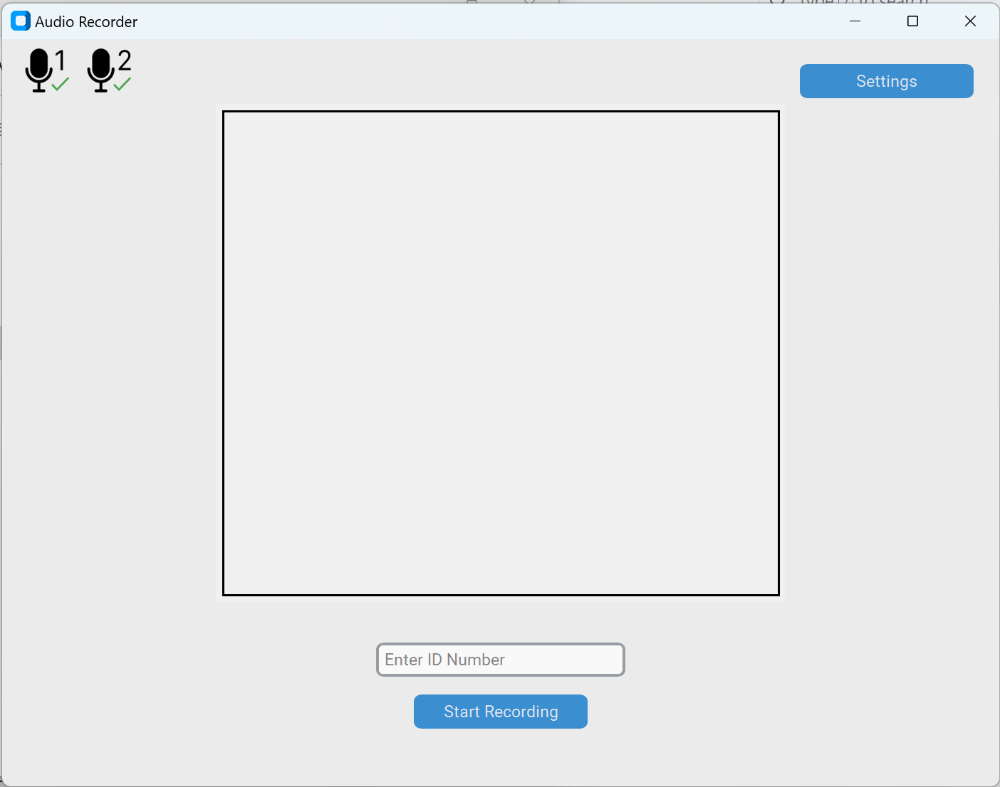

<picture>
 <source media="(prefers-color-scheme: dark)" srcset="images/Interface.png">
 <source media="(prefers-color-scheme: light)" srcset="images/Interface.png">
 
</picture>

### Biometric Voice App for Dual Input Recording

This Project was developed By Ansen Herrick for the Computer Engineering Department at Clarkson University 

### Background

By measuring and observing the slight differences between how different people say different words. Researchers at clarkson university are able to differentiate two different people or determine if two voices belong to the same human. This application aids in this process by taking recordings from various subjects that are either text independent or text dependent. 
